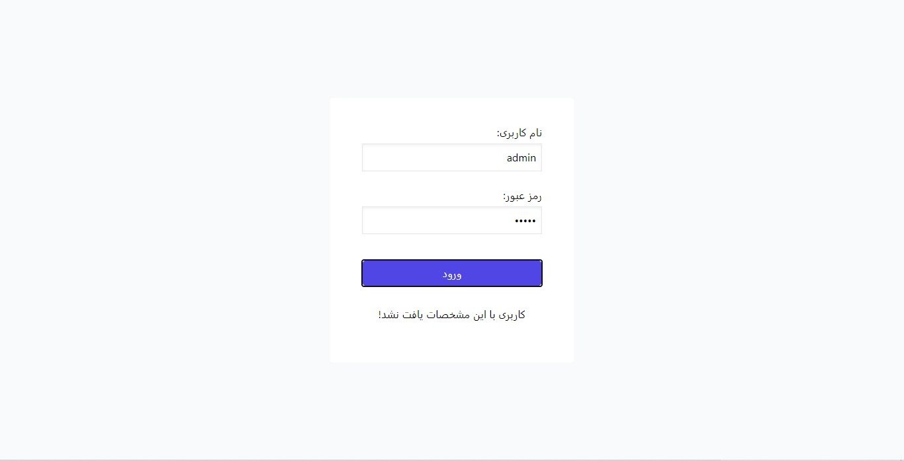
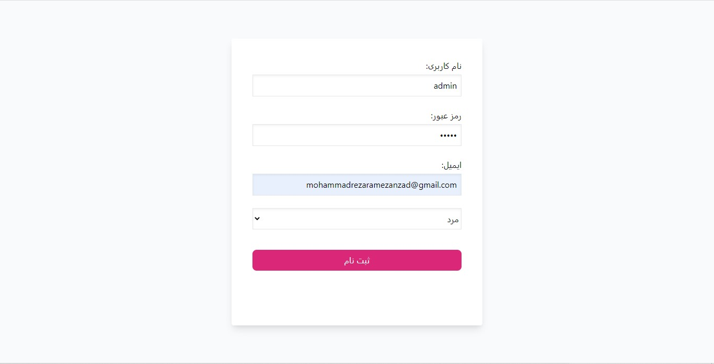
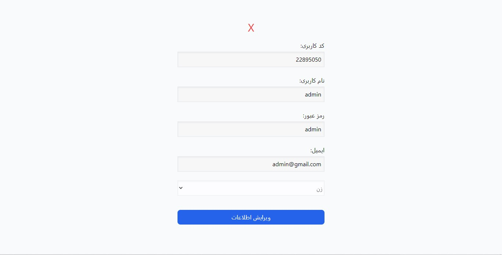
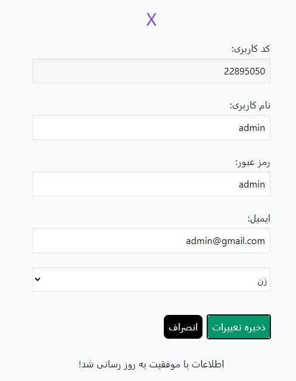
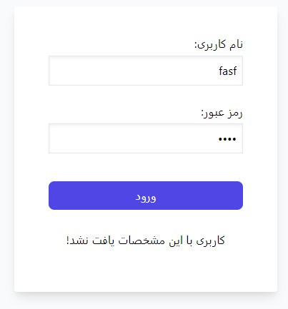
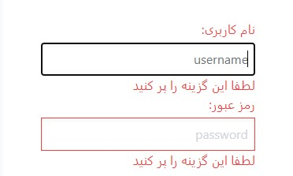
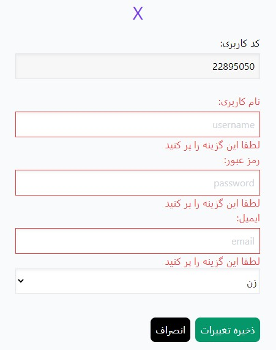

# File_Based_Authorization_System

This is a system to ***signup, login and logout without database*** and just by keeping ***data in files*** locally.
for ***UI*** we used ***tailwind*** css library which gives you different feeling of using this app.

> givin proper errors in different situations is a consistent feature of our apps

### other pages of application

- Register

  

- Dashboard 

  
- incorrect pages
  
  

### Dashboard Features
- editing user informations

  

- logout
  
  
  

### Security Features
- no one can get into dashboard without login
  > if you try to get into dashboard without logging in you'll be  redirected to login page

- if user changes password, system will log them out to make sure they remember the correct password
  
- Proper messaging in different cases
  
  - login and logout
    
    
    

  - successfully editing user informations 
  
    
    
  - if the identification is failed

    

  - empty inputs

    
    
